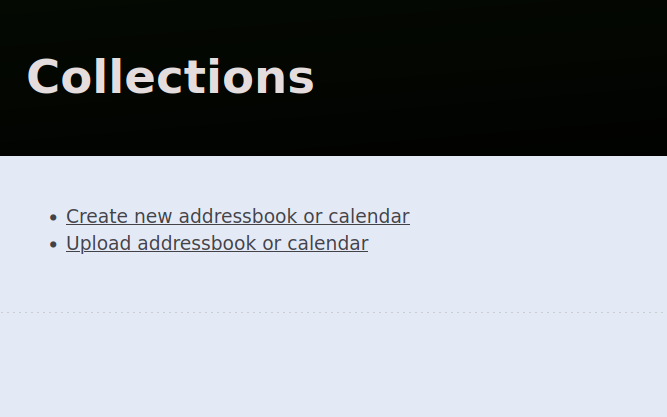
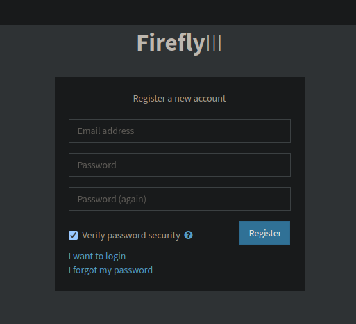
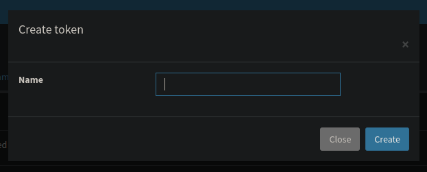

# MiC Manager

[![Building][build-badge]][build-url]
[![Test][test-badge]][test-url]
[![CodeQL Analysis][codeql-badge-url]][codeql-url]
[![Documentation][docs-badge-url]][docs-url]

[![Docker Hub Version][docker-badge-url]][docker-hub-url]

![package.json version][package-version-badge]
![Last pre-release][prerelease-badge]
![Last release][release-badge]

## Environment variables

There are some environment variables which are required for the server to work. Those are:

### `DB_USERNAME`

**Required**. The username to use for connecting to the database.

### `DB_PASSWORD`

**Required**. The password for the given username.

### `DB_HOSTNAME`

**Required**. The server address for the database.

### `DB_DATABASE`

**Required**. The name of the database to use. `DB_USERNAME` must be granted to modify and access it.

### `CALDAV_HOSTNAME`

**Required**. The server address for the CalDAV server.

### `CALDAV_USERNAME`

**Required**. The username to use for signing in to the CalDAV server.

### `CALDAV_PASSWORD`

**Required**. The password to use with `CALDAV_USERNAME`.

### `CALDAV_AB_URL`

**Required**. The url of the address book to use.

### `CALDAV_DISPLAY_NAME`

Default: `MiC-Manager`. The display name for the DAV collection if it doesn't exist.

### `LOG_LEVEL`

Default: `warn`. Options (from least to most important): `debug`, `info`, `warn`, `error`.

# User information

By default, MiC Manager doesn't support storing any users' information. For this, a WebDAV server must be used.
We recommend [Radicale](https://radicale.org).

# Docker configuration

We provide you a docker compose file ([`docker-compose.yml`](./docker-compose.yml)) that is almost ready to go, with all
the necessary containers configured. However, there are some extra options you must set.

Just as a note, the Radicale users match the server's registered users. You might want to create a specific user for
this purpose.

## Secrets

We need some secret keys and files for the system to work. You can define them with the following commands.

```shell
# Create the required directories
mkdir -p secrets
mkdir -p keys

# Replace {password} with the password to use for the database user.
echo "{password}" > secrets/password.txt

# Replace {password} with the password to use for identifying as {username}. Choose wisely.
echo "{root-password}" > secrets/root-password.txt

# Replace {firefly-password} with the password to use for the Firefly database
echo "{firefly-password}" > secrets/firefly-password.txt

# Replace {firefly-root-password} with the password to use for the root user in the Firefly database
echo "{firefly-root-password}" > secrets/firefly-root-password.txt

# The app key to use for Firefly
# Note: must have exactly 32 chars
# Warning! Make sure there's no new line inserted in the file. Otherwise Firefly won't boot.
echo "{firefly-app-key}" > secrets/firefly-app-key.txt

# Generate the server's private key.
openssl rand -base64 756 > secrets/private.key

# Generate the encryption certificates (optional, generates automatically)
openssl req -newkey rsa:2048 -new -nodes -x509 -days 3650 -keyout keys/key.pem -out keys/cert.pem
```

**Warning!** Losing the server's private key will mean all the user's data will be voided and encrypted forever.

Note that it's required to have swarm mode enabled. You can do so with:

```shell
docker swarm init
```

## Environment file

You must create a `.env` file with some variables to use. This is:

```dotenv
# Choose some username and name for the database, you can make up whatever
DB_USERNAME=micmanager
DB_DATABASE=MiCManager

# The username of the currently logged in user.
# If on Linux, you can create a new user with:
#   sudo addgroup --gid 2999 radicale
#   sudo adduser --gid 2999 --uid 2999 --shell /bin/false --disabled-password --no-create-home radicale
# If using those commands, leave password empty
CALDAV_USERNAME=
CALDAV_PASSWORD=

# Choose an UUIDv4, can be whatever. Generate a random one at https://uuidv4.com/
CALDAV_AB_UUID=9f13c1ce-2501-3f7d-17a4-562294ab6530
```

## Setting `CALDAV_AB_URL`

To know which url to set. First access the web interface for Radicale. Eg: http://localhost:5232/.web/.

Then, log in, and choose one of the options provided, either creating an empty address book, or import an existing one.


## Firefly

You can edit the `firefly.env` file based on your needs. It's recommended to update `SITE_OWNER`, `DEFAULT_LANGUAGE`
and `TZ`. See the Firefly docs for more information.

You should also update the `REDIS_PASSWORD` environment variable in the `docker-compose.yml` file. Remember that if
you want to change it, you must update both in `firefly` (`environment`) and `firefly_cache` (`command`).

# First launch

## Firefly

To configure the Firefly instance. Once the Docker containers are running, please access http://{ip}:8080 (e.g.
[http://localhost:8080](http://localhost:8080)).\
Then, create a new admin account with your credentials:


Once registered, it's not necessary to create a new account. Simply go to *Options > Profile*
([`/profile`](http://localhost:8080/profile)), then select *OAuth*, and create a new Personal Access Token.


Now copy this token to `secrets/firefly-token.txt`.

# Migration

## GesTro

MiC Manager provides the option to migrate all the data from GesTro. There's a script at `/migrations` called
`gestro.js` that has all the tools necessary. To run, first install all the dependencies:

```shell
yarn install
```

And now run the script. Replace all the fields accordingly.

```shell
yarn run migrate-gestro HOSTNAME={hostname} PORT=1433 DATABASE=GesTro SCHEMA=dbo USERNAME={username} PASSWORD={password} INSTANCE={mic-instance}
```

*Note: The given MiC instance must contain the protocol (e.g. https://...) and be without a trailing `/`*

---

[codeql-badge-url]: https://img.shields.io/github/workflow/status/ArnyminerZ/MiC-Manager/CodeQL?label=CodeQL&style=for-the-badge&logo=github

[codeql-url]:https://github.com/ArnyminerZ/MiC-Manager/security/code-scanning

[docker-badge-url]: https://img.shields.io/docker/v/arnyminerz/mic_manager?style=for-the-badge&logo=docker

[docker-hub-url]: https://hub.docker.com/repository/docker/arnyminerz/mic_manager

[package-version-badge]: https://img.shields.io/github/package-json/v/ArnyminerZ/MiC-Manager?label=Dev%20Version&logo=github&style=for-the-badge

[prerelease-badge]: https://img.shields.io/github/v/release/ArnyminerZ/MiC-Manager?include_prereleases&label=Last%20Pre-Release&logo=github&style=for-the-badge

[release-badge]: https://img.shields.io/github/v/release/ArnyminerZ/MiC-Manager?label=Last%20Release&logo=github&style=for-the-badge

[releases-url]: https://github.com/ArnyminerZ/MiC-Manager/releases

[build-badge]: https://img.shields.io/github/workflow/status/ArnyminerZ/MiC-Manager/docker-ci?style=for-the-badge

[build-url]: https://github.com/ArnyminerZ/MiC-Manager/actions/workflows/docker-ci.yml

[test-badge]: https://img.shields.io/github/workflow/status/ArnyminerZ/MiC-Manager/Test?style=for-the-badge&label=Test

[test-url]: https://github.com/ArnyminerZ/MiC-Manager/actions/workflows/test.yml

[docs-url]: http://arnaumora.me/MiC-Manager/

[docs-badge-url]: https://img.shields.io/github/workflow/status/Arnyminerz/MiC-Manager/Deploy%20static%20content%20to%20Pages?label=Documentation&style=for-the-badge&logo=swagger
